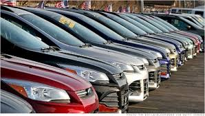

# CAR Sales ANALYTICS WITH ATTRITION PREDICTION

## INTRODUCTION

This dataset was collected from car sale advertisements between years 1953 to 2016 for study/practice purposes.
Duplicate records were deleted.The missing values of engine volume were replaced with the mean. Preprocessing has been done. It is just about __improving__ the sales of Car.

## PROJECT ANALYSIS

- In this dataset We have total 9576 observations after removing duplicate records.
- We observe that out of total cars sold, majority of the cars sold by "Volkswagen", "Mercedes-Benz" and "BMW" brand.
- "Sedan", "Crossover" and "Hatch" body types cars are the highest sold cars.
- "Front" drive type segment cars are the highest sold cars, because most of the cars of this segment falls in lower price range.
- 80% of total cars sold in the price range of 200 to 20000 with body type as "Sedan", drive type as "Front" and engine type as "Petrol", - because the middle class families preferred low price cars with Sedan body and Petrol engine type.
- "Mercedes-Benz" is the leading brand in higher price segment cars.
- Majority of the higher price range cars sold with body type as "Crossover", drive type as "Full" and engine type as "Diesel".
- All body segment of cars have more average price for "Full" drive type cars compare to other drive type cars.
- Approx. 55% of total cars sold have engine volume in the range of 1.5 CC to 2.5 CC.
- We have also observed that lower price segment car has higher mileage and higher price segment car has lower mileage.
- Majority of the cars with production year 2008 or later were registered in Ukraine sold in price of 50000 or lower.
- Production year 2008 and 2012 cars are the highest sold cars.

[Jupyter Notebook](./CarSales_EDA.ipynb)
